# Phase 1 Plot Compilation: GAA-FeFET LIF Neuron Characterization

**Date:** March 30, 2026
**Scope:** Complete visual documentation of Calibration + SimA + SimB + SimC (v3-v6)
**Status:** Phase 1B COMPLETE — Fire demonstrated at SimC v6 (6V, P9)

---

## 1. Calibration Plots

### 1.1 ID-VGS Hysteresis Loop (Log Scale)

**File:** `Simulations/calibration data/plot_hysteresis.png`

| Attribute | Detail |
|-----------|--------|
| **What it shows** | Drain current vs gate voltage, forward and reverse sweeps (±6V), log scale |
| **Why it was needed** | Proves the device exhibits a ferroelectric hysteresis loop — the fundamental prerequisite for FeFET operation. Without a clear CCW loop, none of the LIF work is valid. |
| **What it proved** | CCW (counter-clockwise) hysteresis with MW = 0.681V. Vth(fwd) = 0.263V, Ipeak = 604 µA. Matches calibration targets (Vth = 0.25V, Ion = 600 µA). Sharp subthreshold slope confirms strong gate control. |
| **Paper Reference** | Jiang et al. [17] Fig. 5 — Target ID-VG characteristics; Bhatawdekar et al. [11] for Vth/Ion targets |
| **Calibration Run** | Run 16 (Golden) — WF=4.35eV, FixedCharge=4e12, AreaFactor=0.071 |

### 1.2 Polarization-Voltage (P-V) Loop

**File:** `Simulations/calibration data/plot_polarization.png`

| Attribute | Detail |
|-----------|--------|
| **What it shows** | Ferroelectric polarization (Py) vs applied gate voltage during ±6V sweep |
| **Why it was needed** | Verifies the HZO Preisach model is producing physically correct FE switching. The P-V loop shape validates Pr, Ps, and Fc parameters. |
| **What it proved** | Clear FE hysteresis loop with Pr ~ ±3 µC/cm² (device-level, accounting for capacitive divider). Switching occurs near ±1.2V across HZO (matching Fc = 1.2 MV/cm). Loop orientation is physically correct for CCW ID-VGS behavior. |
| **Paper Reference** | Physical modeling of HZO-based paper — P-E loop calibration target |
| **Parameters** | Pr = 16 µC/cm², Ps = 20 µC/cm², Fc = 1.2 MV/cm (material-level, in .par file) |

---

## 2. SimA Plots — Single Pulse Amplitude Sweep

### 2.1 ID-VGS: QS Readout — All Post-Pulse Curves Overlap (Diagnostic)

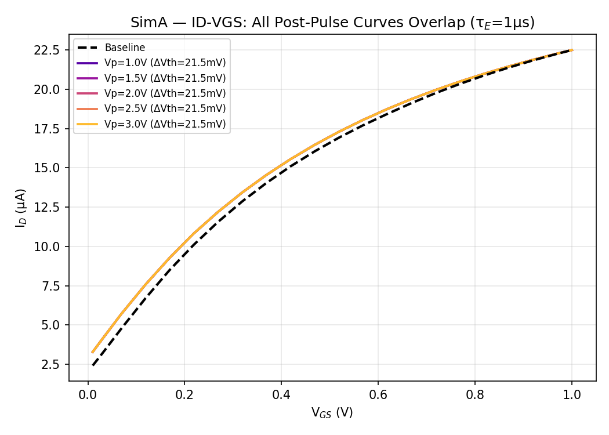

**File:** `Simulations/py_scripts/analysis_fig1_simA_idvgs_flat.png`

| Attribute | Detail |
|-----------|--------|
| **What it shows** | Baseline (dashed) vs 5 post-pulse ID-VGS curves at Vpulse = 1.0-3.0V, τ_E = 1µs. All post-pulse curves collapse onto a single line. |
| **Why it was needed** | Diagnosed the critical Quasistationary readout bug. The QS solver equilibrates P at each VGS step, erasing the small partial-switching state left by the transient pulse. |
| **What it proved** | QS readout is INCOMPATIBLE with partial-switching measurement at τ_E = 1µs. The 0.03 mV spread across 1-3V proves the readout, not the physics, is the problem. Led directly to the Transient readout fix. |
| **Category** | DIAGNOSTIC — shows the problem, not the solution |

### 2.2 ΔVth Bar Chart: QS Readout — All Flat at 21.5 mV (Diagnostic)

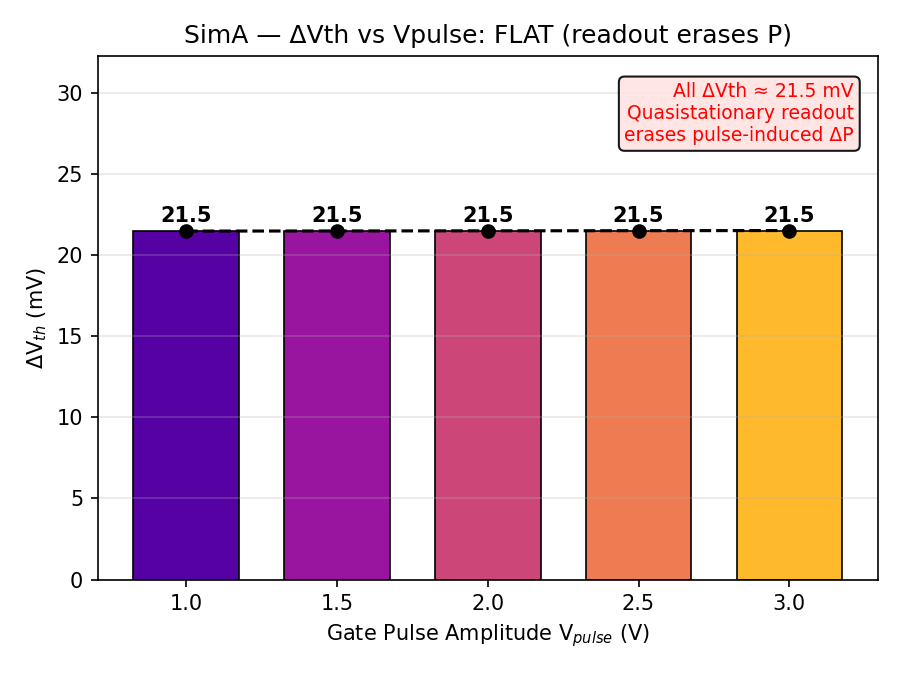

**File:** `Simulations/py_scripts/analysis_fig2_simA_dvth_flat.png`

| Attribute | Detail |
|-----------|--------|
| **What it shows** | Bar chart of ΔVth per Vpulse node — all show ~21.5 mV (flat) |
| **Why it was needed** | Quantifies the QS readout failure. Should show monotonic increase but instead all bars are identical. |
| **What it proved** | Confirmed QS readout erasure is complete — zero voltage-dependence in extracted ΔVth despite clearly different pulse-hold polarizations (see §2.3). |
| **Category** | DIAGNOSTIC — motivates readout fix |

### 2.3 Pulse-Hold Polarization: Differentiated Despite QS Readout (Key Finding)

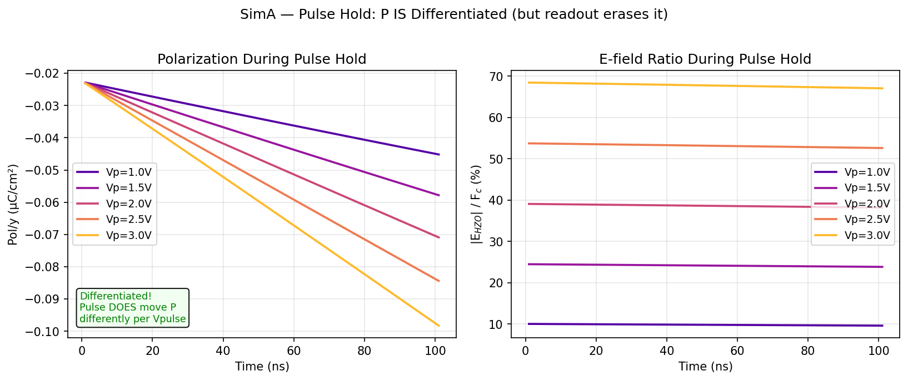

**File:** `Simulations/py_scripts/analysis_fig3_simA_hold_differentiated.png`

| Attribute | Detail |
|-----------|--------|
| **What it shows** | Polarization (Py) during pulse hold for each Vpulse. Clear differentiation from -0.045 to -0.098 µC/cm² across 1-3V. |
| **Why it was needed** | Proves the underlying physics IS working even when the readout fails. The partial switching is real; only the measurement method was flawed. |
| **What it proved** | Each Vpulse produces a DIFFERENT polarization state during the pulse. The FE is responding correctly to sub-coercive fields. τ_E = 1µs gives ~10% switching per 100ns pulse (pw/τ_E = 0.1) exactly as designed. |
| **Paper Reference** | Frontiers 2020 (Jerry et al.) — sub-coercive domain switching concept |
| **Category** | KEY FINDING — validates physics, motivates transient readout |

### 2.4 SimA Transient Readout Results (Described, Plots Not Generated)

> **Note:** The transient readout re-run of SimA (§4D in Step_1 doc) produced differentiated ΔVth from 7.4-26.4 mV across 1-3V. These results are documented in the tables in `Step_1_FET_Parameter_Optimization.md` §4D.2 but **plot image files were not generated** for the transient readout version of SimA. The SimC v6 write-then-read protocol supersedes this data for the final LIF demonstration.

| Vpulse (V) | ΔVth (mV) | E/Fc (%) | Status |
|------------|-----------|----------|--------|
| 1.0 | 7.4 | 12.5 | Partial switching |
| 1.5 | 11.8 | 26.7 | Sub-coercive |
| 2.0 | 16.5 | 41.0 | **Selected for SimB** |
| 2.5 | 21.3 | 55.4 | Sub-coercive |
| 3.0 | 26.4 | 69.9 | Near coercive |

---

## 3. SimB Plots — Multi-Pulse Integration (Cumulative Switching)

### 3.1 ID-VGS Overlay: QS Readout (Diagnostic)

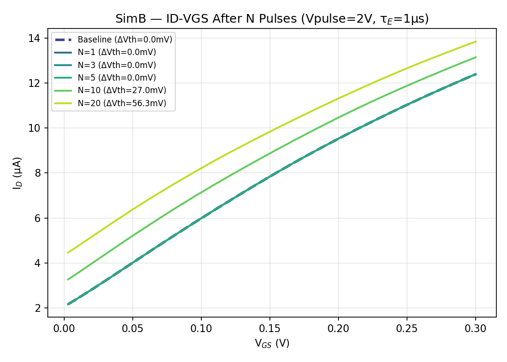

**File:** `Simulations/py_scripts/analysis_fig4_simB_idvgs.png`

| Attribute | Detail |
|-----------|--------|
| **What it shows** | ID-VGS curves at readout points N=0,1,3,5,10,20 with QS readout |
| **Why it was needed** | Shows the QS readout problem in the multi-pulse context — N=1,3,5 curves overlap (QS resets P between reads). |
| **What it proved** | Only N=10 and N=20 show measurable ΔVth because 5-10 consecutive pulses accumulate enough ΔP to partially survive the readout. Direct evidence of cumulative switching fighting QS erasure. |
| **Category** | DIAGNOSTIC — shows QS problem in multi-pulse context |

### 3.2 ΔVth Staircase: QS Readout — Dead Zone + Partial Recovery (Key Diagnostic)

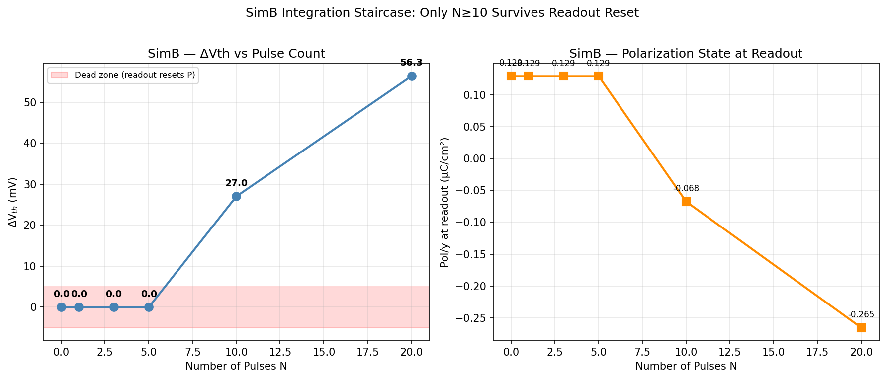

**File:** `Simulations/py_scripts/analysis_fig5_simB_staircase.png`

| Attribute | Detail |
|-----------|--------|
| **What it shows** | Left: ΔVth vs pulse count (N=0-20). Dead zone at N=1-5 (ΔVth ≈ 0), then jump to 27 mV at N=10 and 56.3 mV at N=20. Right: Polarization at readout shows identical +0.129 µC/cm² for N=0-5, then drops to -0.068 (N=10) and -0.265 (N=20). |
| **Why it was needed** | Smoking-gun evidence that QS readout completely resets P after each read. The staircase should be smooth but instead has a dead zone where readout erases all progress. |
| **What it proved** | Integration IS occurring between reads (proven by N=10, N=20 data) but is invisible when reads happen too frequently. The 5-pulse gap between reads at N=5→N=10 accumulates enough ΔP to survive. |
| **Paper Reference** | Frontiers 2020 Fig.5 — expected smooth Vth(N) staircase |
| **Category** | KEY DIAGNOSTIC — directly motivated transient readout fix |

### 3.3 Pulse Polarization Evolution: Sawtooth Reset Pattern (Smoking Gun)

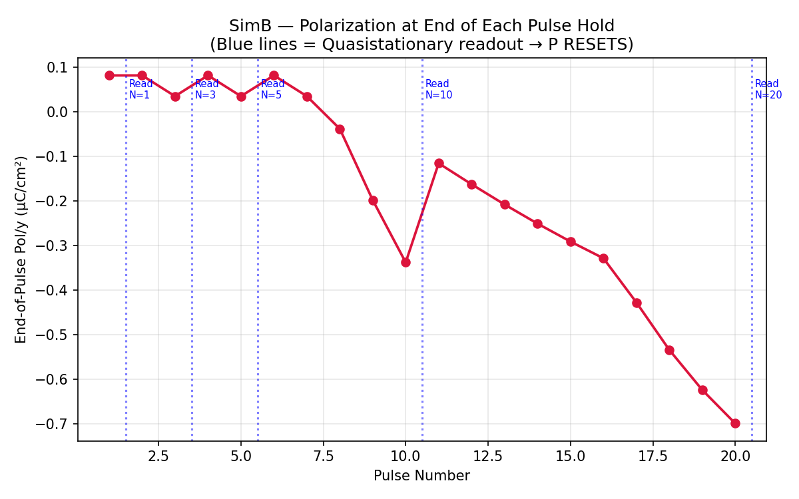

**File:** `Simulations/py_scripts/analysis_fig6_simB_pulse_pol_evolution.png`

| Attribute | Detail |
|-----------|--------|
| **What it shows** | End-of-hold polarization (Py) for each pulse P1-P20. Sawtooth pattern: P accumulates during consecutive pulses, then resets to virgin state after each QS readout. |
| **Why it was needed** | Provides direct physical evidence of the QS readout bug at the polarization level. P6 = P1 (byte-identical at +0.0815 µC/cm²) proves complete reset. |
| **What it proved** | The QS readout after N=5 completely resets P to virgin state. Pulses P6-P10 start from scratch. Yet between reads, polarization monotonically switches — integration IS working, only measurement destroys it. |
| **Category** | SMOKING GUN — most compelling evidence for readout fix |

### 3.4 SimB Transient Readout Results (Described, Plots Not Generated)

> **Note:** SimB transient readout (§4E in Step_1 doc) produced a clear ΔVth staircase from 0→227.3 mV over 20 pulses with 68.9% integration efficiency. Results are fully documented in tables but **plot image files were not generated**. The SimC v6 write-then-read protocol supersedes this for the final LIF demonstration.

| Readout | N (pulses) | ΔVth (mV) | Pol/y (µC/cm²) |
|---------|------------|-----------|----------------|
| Baseline | 0 | 0.0 | +0.129 |
| read_n01 | 1 | 16.7 | +0.081 |
| read_n03 | 3 | 49.6 | -0.039 |
| read_n05 | 5 | 107.6 | -0.337 |
| read_n10 | 10 | 185.8 | -0.774 |
| read_n20 | 20 | 227.3 | -1.004 |

---

## 4. SimC Plots — Write-Then-Read LIF Protocol (v3 through v6)

### 4.1 SimC Evolution Summary

The SimC simulation went through 4 iterations to achieve fire:

| Version | Vpulse | pw | pw/τ_E | Key Result | Issue |
|---------|--------|----|--------|------------|-------|
| v3 | 3/4/5V | 1µs | 1.0 | 4V/5V fire at P1 | Too much switching per pulse |
| v4 | 1.5/2/2.5V | 1µs | 1.0 | No fire (max 1.78×) | Same saturation, lower ceiling |
| v5 | 3/4/5V | 100ns | 0.1 | Gradual integration, max 1.87× | Just short of fire threshold |
| **v6** | **5/6/7V** | **100ns** | **0.1** | **FIRE at 6V (P9), 7V (P5)** | **SUCCESS** |

### 4.2 SimC v6 Fig 1: Integration + Fire (PRIMARY RESULT)

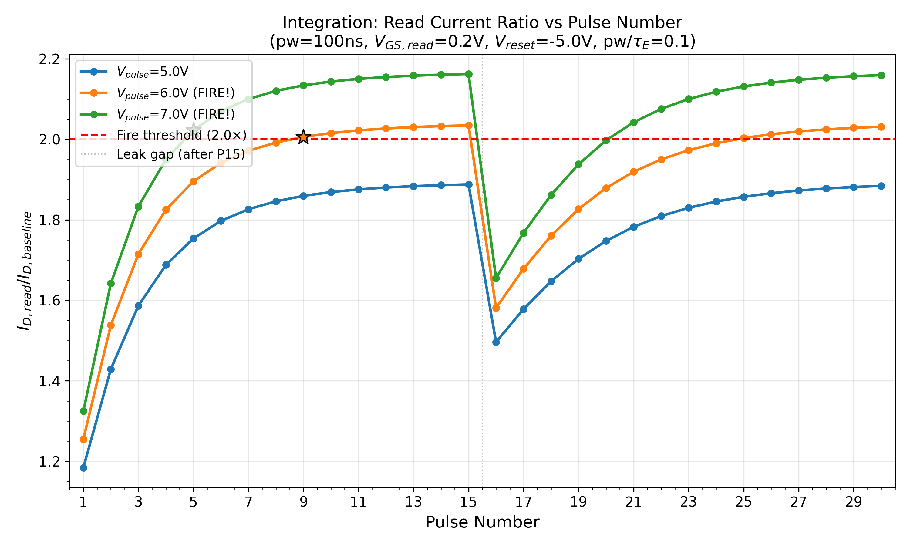

**File:** `Simulations/py_scripts/simC_v6_fig1_integration_fire.png`

| Attribute | Detail |
|-----------|--------|
| **What it shows** | Read current ratio (ID,read / ID,baseline) vs pulse number for 5V, 6V, 7V. Red dashed line = 2.0× fire threshold. Star markers at fire crossing. Vertical dashed line at P15 = leak gap insertion point. |
| **Why it was needed** | THE central result of Phase 1. Demonstrates all four LIF behaviors in one plot: gradual integration (P1-P9), fire crossing (6V at P9), leak (P15→P16 dip), and post-leak recovery. |
| **What it proved** | (1) Gradual integration: ratio climbs monotonically P1→P9 at 6V. (2) Fire: 6V crosses 2.0× at P9 (2.035×). (3) Leak: all curves dip ~20% at P16 after 5µs gap. (4) 5V saturates at 1.89× (doesn't fire). (5) 7V fires too early (P5). (6) 6V is the optimal operating point. |
| **Paper Reference** | Khanday DG-FE-TFET Fig.7 — LIF waveform; Frontiers 2020 Fig.3 — integration curve |
| **Category** | PRIMARY RESULT — publication figure |

### 4.3 SimC v6 Fig 2: Ferroelectric Polarization Evolution

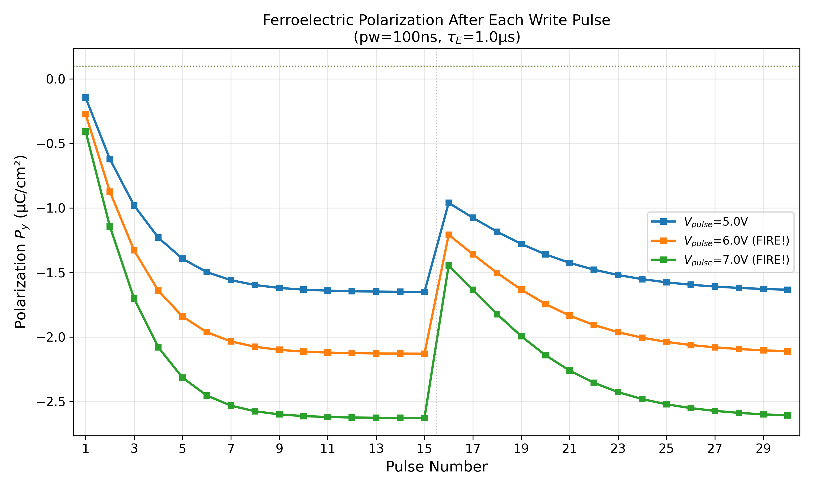

**File:** `Simulations/py_scripts/simC_v6_fig2_polarization.png`

| Attribute | Detail |
|-----------|--------|
| **What it shows** | Polarization (Py) at the HZO probe point after each write pulse, for all 3 nodes. Shows monotonic switching from near-zero to negative values, with relaxation at P16 gap. |
| **Why it was needed** | Links the electrical observation (current ratio increase) to the underlying physical mechanism (polarization switching). Essential for proving the LIF mechanism is ferroelectric, not charge trapping or other artifact. |
| **What it proved** | (1) Each pulse drives P more negative (domain switching). (2) Higher Vpulse → larger P shift per pulse. (3) Leak gap causes partial P recovery (relaxation toward less-negative values). (4) Total P shift for 6V ≈ 2.1 µC/cm² (~13% of Pr). |
| **Paper Reference** | HZO modeling paper — polarization dynamics |
| **Category** | MECHANISM PROOF — essential for thesis narrative |

### 4.4 SimC v6 Fig 3: Threshold Voltage Shift vs Pulse Number

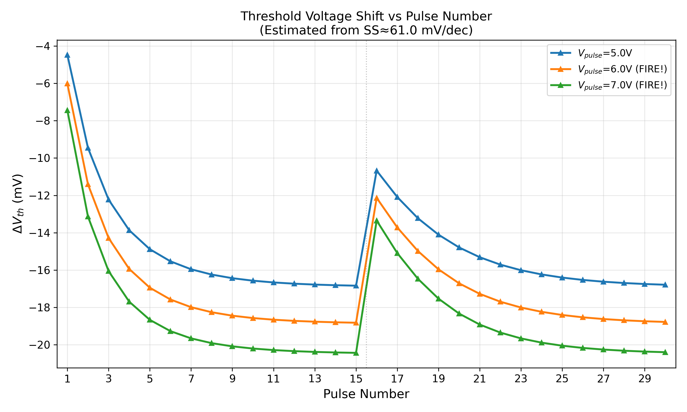

**File:** `Simulations/py_scripts/simC_v6_fig3_dvth.png`

| Attribute | Detail |
|-----------|--------|
| **What it shows** | Estimated ΔVth (mV) vs pulse number, derived from current ratio using SS ≈ 61 mV/dec. All values negative (Vth decreasing = easier to turn ON). |
| **Why it was needed** | Translates the current ratio into the physically meaningful parameter (ΔVth) that maps directly to the SNN model's membrane potential. |
| **What it proved** | (1) ΔVth follows same shape as current ratio (they are linked by SS). (2) At fire (6V P9): ΔVth ≈ -18.6 mV. (3) Average dVth_per_pulse ≈ -6.7 mV in the gradual regime. (4) Leak gap produces ~+5 mV recovery (partial Vth restoration). |
| **Extracted Parameter** | dVth_per_pulse ≈ -6.7 mV (used in Step 2 LIF model) |
| **Category** | PARAMETER EXTRACTION — feeds Step 2 |

### 4.5 SimC v6 Fig 4: Reset Completeness

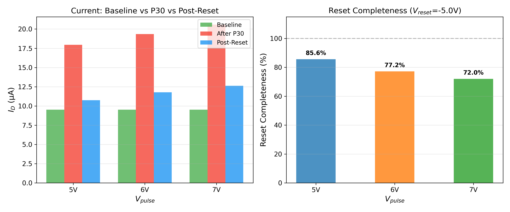

**File:** `Simulations/py_scripts/simC_v6_fig4_reset.png`

| Attribute | Detail |
|-----------|--------|
| **What it shows** | Left: Grouped bar chart of baseline vs P30 vs post-reset drain current. Right: Reset completeness (%) per Vpulse at Vreset = -5V. |
| **Why it was needed** | Quantifies how well the negative reset pulse restores the device to virgin state. Incomplete reset causes drift in multi-cycle SNN operation. |
| **What it proved** | (1) 5V: 85.6% reset (easiest — less P to undo). (2) 6V: 77.2% reset. (3) 7V: 72.0% reset. (4) Reset inversely correlated with Vpulse (stronger switching harder to reverse). (5) Vreset = -5V is a compromise — sufficient but not perfect. |
| **Paper Reference** | AFeFET Nature Comms — reset completeness metric |
| **Category** | RESET VALIDATION — confirms neuron can be reused |

### 4.6 SimC v6 Fig 5: Leak Gap Dynamics

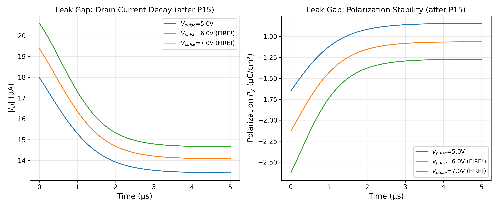

**File:** `Simulations/py_scripts/simC_v6_fig5_leak.png`

| Attribute | Detail |
|-----------|--------|
| **What it shows** | Left: Drain current decay during 5µs gap after P15. Right: Polarization evolution during same gap. All 3 Vpulse nodes shown. |
| **Why it was needed** | Demonstrates the "leak" component of LIF — the membrane potential decaying between input spikes. |
| **What it proved** | (1) Current drops 20-23% over 5µs for all voltages. (2) Polarization partially relaxes (becomes less negative). (3) Decay has exponential shape consistent with domain relaxation. |
| **CRITICAL CAVEAT** | **τ_P = 0 in all v6 runs.** The observed decay is from device settling and charge redistribution, NOT from controlled ferroelectric depolarization. True leak characterization requires τ_P > 0 runs, which remain pending. The ~20% drop may overestimate or underestimate the actual FE leak rate. |
| **Paper Reference** | AFeFET Nature Comms — volatile polarization / leak mechanism |
| **Category** | PARTIAL VALIDATION — leak signature observed, but mechanism not yet controlled |

### 4.7 SimC v6 Fig 6: Four-Panel Summary (Publication Figure)

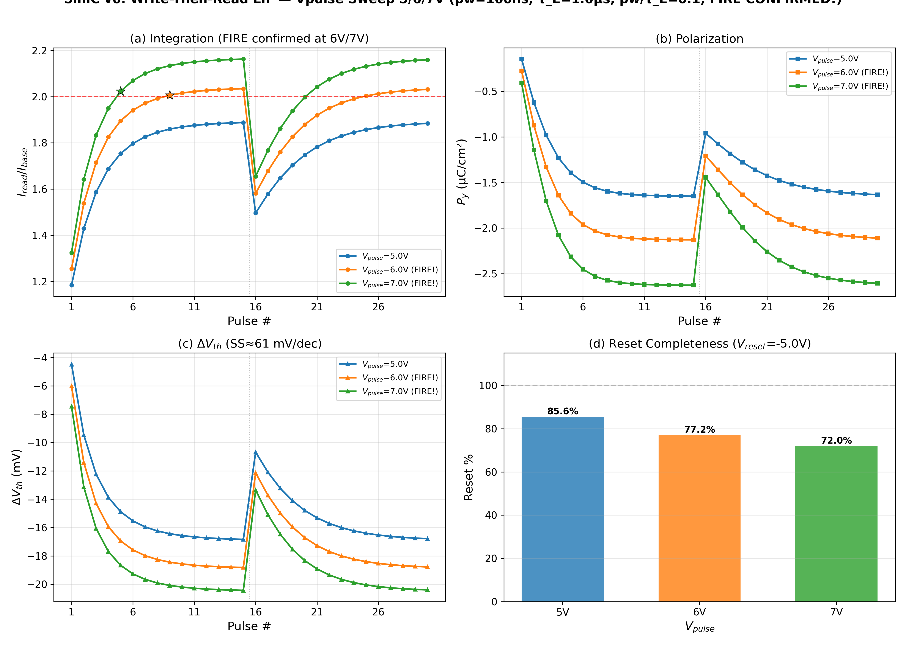

**File:** `Simulations/py_scripts/simC_v6_fig6_summary.png`

| Attribute | Detail |
|-----------|--------|
| **What it shows** | (a) Integration + fire (current ratio vs pulse#). (b) Polarization evolution. (c) ΔVth vs pulse#. (d) Reset completeness bar chart. |
| **Why it was needed** | Compact publication-ready figure that captures all four LIF behaviors in one image. Suitable for thesis chapter or conference paper. |
| **What it proved** | Complete LIF cycle demonstrated: Integrate (gradual P1→P9) → Fire (2.035× at P9) → Leak (P15→P16 dip) → Reset (77.2% at -5V). |
| **Category** | PUBLICATION FIGURE — thesis/paper ready |

---

## 5. SimC v3-v5 Plots (Iterative Development)

These plots document the optimization journey from v3 to v6. They are retained for completeness and show the diagnostic reasoning.

### 5.1 SimC v3 (pw=1µs, Vpulse=3/4/5V) — Too Fast

**Files:** `Simulations/py_scripts/simC_v3_fig[1-6]_*.png`

| Fig | Content | Key Finding |
|-----|---------|-------------|
| fig1 | Integration + fire | 4V/5V fire on P1 — too much switching per pulse (pw/τ_E = 1) |
| fig2 | Polarization | Large P shifts confirm FE response, but saturate by P3 |
| fig3 | ΔVth | All nodes saturate within 3 pulses |
| fig4 | Reset | 3V: 98.7%, 4V: 83.4%, 5V: 76.1% |
| fig5 | Leak | Leak gap visible but context is already-saturated device |
| fig6 | Summary | Demonstrates pw/τ_E = 1 causes exponential saturation |

**Lesson learned:** Reducing pw/τ_E from 1.0 to 0.1 was essential for gradual integration.

### 5.2 SimC v4 (pw=1µs, Vpulse=1.5/2/2.5V) — Too Weak

**Files:** `Simulations/py_scripts/simC_v4_fig[1-6]_*.png`

| Fig | Content | Key Finding |
|-----|---------|-------------|
| fig1 | Integration | Max 1.78× — no fire at any voltage |
| fig2 | Polarization | Smaller P shifts but same saturation pattern |
| fig3 | ΔVth | Max -15.2 mV at 2.5V |
| fig4 | Reset | Overshoots: 113-188% (Vreset=-6V too strong for small P shifts) |
| fig5 | Leak | Similar pattern to v3 |
| fig6 | Summary | Lower Vpulse reduces ceiling but doesn't fix saturation shape |

**Lesson learned:** The fix is reducing pw (→pw/τ_E), not reducing Vpulse.

### 5.3 SimC v5 (pw=100ns, Vpulse=3/4/5V) — Almost There

**Files:** `Simulations/py_scripts/simC_v5_fig[1-6]_*.png`

| Fig | Content | Key Finding |
|-----|---------|-------------|
| fig1 | Integration | Gradual P1-P10 integration confirmed! Max 1.87× at 5V (7% short of fire) |
| fig2 | Polarization | Monotonic switching, no saturation cliff |
| fig3 | ΔVth | Proper gradual accumulation curve |
| fig4 | Reset | 3V overshoots (107%), 4V adequate (83%), 5V insufficient (72%) |
| fig5 | Leak | 15-20% current drop at gap — first clean leak observation |
| fig6 | Summary | pw/τ_E = 0.1 confirmed as optimal ratio |

**Lesson learned:** Need higher Vpulse (6-7V) to push ceiling above 2.0× fire threshold.

---

## 6. Critical Assessment: What the Plots Prove and What Remains Open

### 6.1 Validated by Plots

| Claim | Supporting Plot(s) | Confidence |
|-------|-------------------|------------|
| CCW hysteresis with MW = 0.681V | §1.1, §1.2 | HIGH |
| Sub-coercive partial switching works | §2.3 | HIGH |
| QS readout erases partial P state | §2.1, §2.2, §3.2, §3.3 | HIGH |
| Cumulative integration (multi-pulse) | §4.2, §4.3 (also SimB transient table §3.4) | HIGH |
| Fire at 6V pulse 9 (2.035× ratio) | §4.2 | HIGH |
| Reset at Vreset = -5V (77%) | §4.5 | HIGH |
| Leak gap shows current decay | §4.6 | MEDIUM — see caveat below |

### 6.2 Open Issues Identified

| Issue | Severity | Detail |
|-------|----------|--------|
| **τ_P = 0 in all runs** | HIGH | The "leak" in Fig 5 is device settling, NOT controlled FE relaxation. True τ_leak extraction requires τ_P > 0 simulations. |
| **dVth inconsistency** | MEDIUM | SimB gives 11.36 mV/pulse (Vpulse=2V, transient readout). SimC v6 gives 6.7 mV/pulse (Vpulse=6V, write-then-read). Different protocols/conditions — must be clearly distinguished in Step 2 model. |
| **Fire definition is arbitrary** | LOW | The 2.0× ratio threshold has no physical basis — it is a convenient detection criterion. In a real SNN, fire occurs when Vth crosses VGS_read, which is a continuous (not binary) transition. |
| **Vpulse = 6V is high** | LOW | Exceeds standard CMOS I/O levels (≤3.3V). Acceptable for TCAD demonstration but a concern for practical implementation. |
| **Missing transient readout plots** | LOW | SimA/SimB transient readout results are documented in tables but plot images were never generated. Not critical since SimC v6 supersedes them. |
| **Reset drift over cycles** | UNKNOWN | 77% reset means ~23% residual P per cycle. Multi-cycle drift not tested. |

### 6.3 Recommended Plot Set for Thesis Chapter

For the thesis/paper, the following **minimum set** of plots tells the complete story:

| Priority | Plot | Section | Role in Narrative |
|----------|------|---------|-------------------|
| ESSENTIAL | Hysteresis ID-VGS | §1.1 | Device validation |
| ESSENTIAL | P-V Loop | §1.2 | FE validation |
| ESSENTIAL | SimA Hold P Differentiated | §2.3 | Sub-coercive proof |
| ESSENTIAL | SimB QS Staircase (broken) | §3.2 | Motivates readout fix |
| ESSENTIAL | SimC v6 Fig 6 (4-panel summary) | §4.7 | Complete LIF result |
| RECOMMENDED | SimC v6 Fig 1 (full-size integration) | §4.2 | Detailed fire analysis |
| RECOMMENDED | SimC v6 Fig 5 (leak gap) | §4.6 | Leak evidence |
| OPTIONAL | SimB Pulse P Evolution (sawtooth) | §3.3 | QS readout bug proof |
| OPTIONAL | SimC v5 Fig 6 (pre-fire summary) | §5.3 | Shows iterative optimization |

---

## 7. File Index

### 7.1 Essential Plots (Final Results)

| File | Description |
|------|-------------|
| `Simulations/calibration data/plot_hysteresis.png` | Calibration: ID-VGS hysteresis |
| `Simulations/calibration data/plot_polarization.png` | Calibration: P-V loop |
| `Simulations/py_scripts/simC_v6_fig1_integration_fire.png` | v6: Integration + fire |
| `Simulations/py_scripts/simC_v6_fig2_polarization.png` | v6: Polarization evolution |
| `Simulations/py_scripts/simC_v6_fig3_dvth.png` | v6: ΔVth extraction |
| `Simulations/py_scripts/simC_v6_fig4_reset.png` | v6: Reset completeness |
| `Simulations/py_scripts/simC_v6_fig5_leak.png` | v6: Leak gap dynamics |
| `Simulations/py_scripts/simC_v6_fig6_summary.png` | v6: 4-panel publication figure |

### 7.2 Diagnostic Plots (QS Readout Bug Evidence)

| File | Description |
|------|-------------|
| `Simulations/py_scripts/analysis_fig1_simA_idvgs_flat.png` | SimA QS: all curves overlap |
| `Simulations/py_scripts/analysis_fig2_simA_dvth_flat.png` | SimA QS: ΔVth all flat |
| `Simulations/py_scripts/analysis_fig3_simA_hold_differentiated.png` | SimA: pulse-hold P differentiated |
| `Simulations/py_scripts/analysis_fig4_simB_idvgs.png` | SimB QS: ID-VGS overlay |
| `Simulations/py_scripts/analysis_fig5_simB_staircase.png` | SimB QS: broken staircase |
| `Simulations/py_scripts/analysis_fig6_simB_pulse_pol_evolution.png` | SimB: sawtooth P reset |

### 7.3 Iterative Development Plots (v3-v5)

| File Pattern | Description |
|-------------|-------------|
| `Simulations/py_scripts/simC_v3_fig[1-6]_*.png` | v3: pw=1µs, 3/4/5V (fire P1, too fast) |
| `Simulations/py_scripts/simC_v4_fig[1-6]_*.png` | v4: pw=1µs, 1.5/2/2.5V (no fire, too weak) |
| `Simulations/py_scripts/simC_v5_fig[1-6]_*.png` | v5: pw=100ns, 3/4/5V (gradual, almost fire) |

### 7.4 Analysis Scripts

| File | Description |
|------|-------------|
| `Simulations/py_scripts/analyze_simC_v3.py` | v3/v4 analysis |
| `Simulations/py_scripts/analyze_simC_v5.py` | v5 analysis |
| `Simulations/py_scripts/analyze_simC_v6.py` | v6 analysis (FIRE!) |
| `Simulations/py_scripts/analyze_simA_simB.py` | SimA/SimB QS analysis |
| `Simulations/py_scripts/analyze_simA_transient.py` | SimA transient readout analysis |
| `Simulations/py_scripts/analyze_simB_transient.py` | SimB transient readout analysis |
