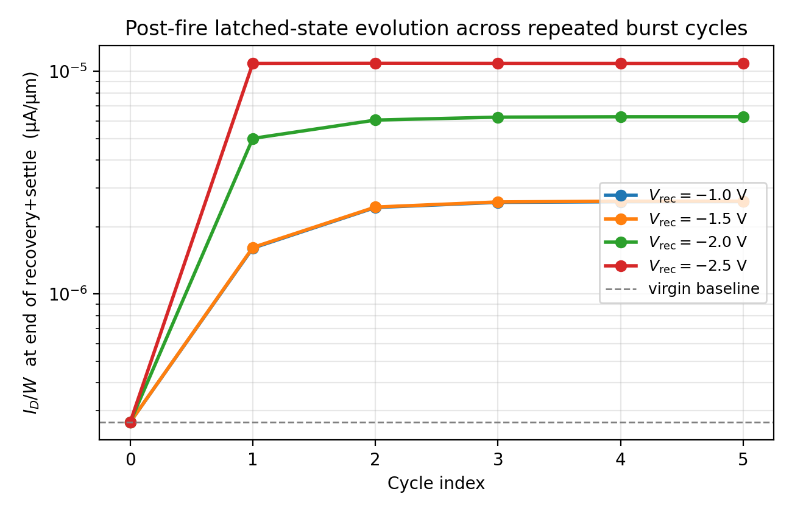
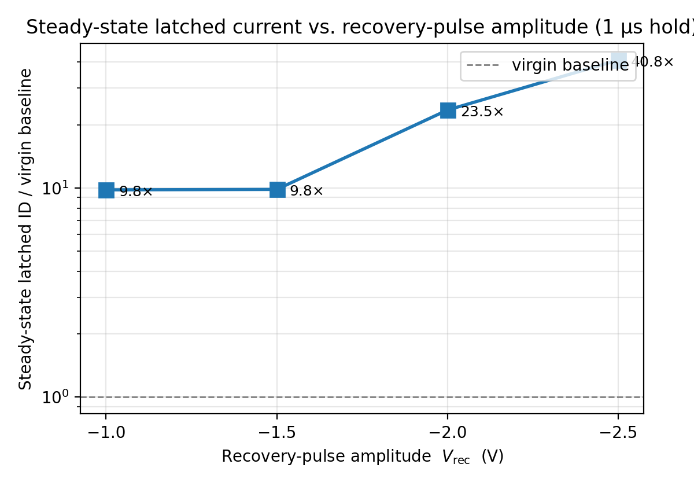
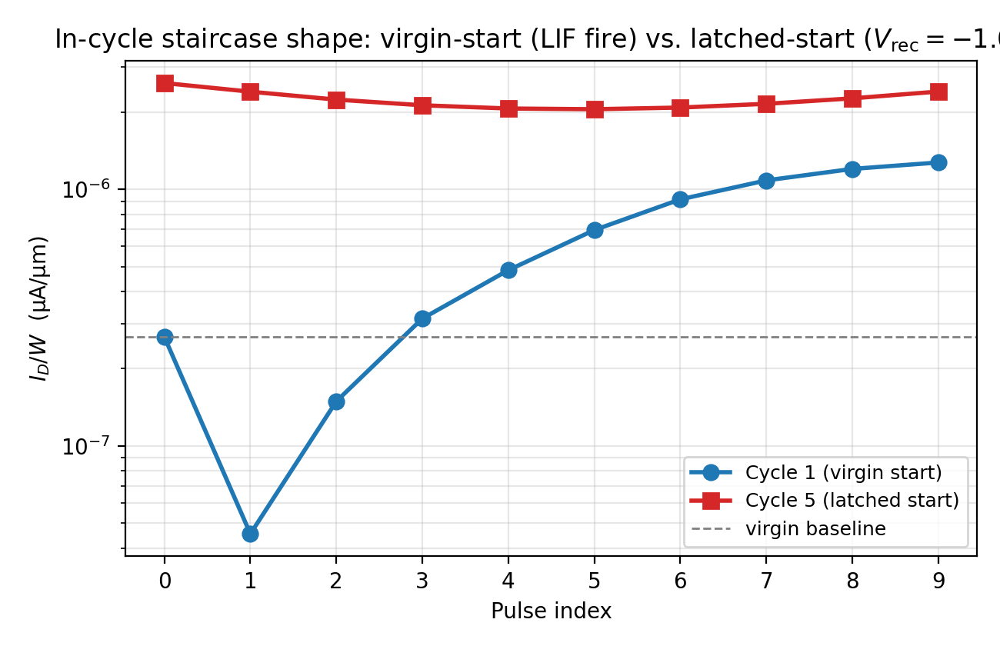

# Post-Fire Recovery Dynamics in the GAA-FeFET

This document reports the response of the GAA-FeFET to repeated leaky-integrate-and-fire (LIF) burst cycles separated by a negative-bias recovery pulse, and characterizes how the device's polarization state evolves across the cycle sequence. The study quantifies (i) the reproducibility of the single-shot integration response from the virgin state, (ii) the cycle-to-cycle stability of the post-fire state under different recovery-pulse amplitudes, and (iii) the in-cycle current trajectory once the device has reached its post-fire stable state.

---

## Summary

- A single 9-pulse burst at `V_pgm = +2.0 V` (100 ns hold, sub-coercive) applied to the device in its virgin polarization state produces a **monotonic ID staircase reaching 4.79× the virgin baseline at the ninth pulse**. The response is reproducible to numerical precision across four independent simulation runs in this study (different recovery-pulse conditions, same fire-burst protocol), confirming the single-shot LIF integration result reported in `Phase1D_LIF_Integration/`.

- Under repeated burst cycles separated by a 1 µs negative-bias recovery pulse and a 10 µs settle, the device reaches a **cycle-to-cycle stable post-fire state within two cycles, with subsequent drift of less than 0.4 % per cycle** across cycles 3–5. The stability holds for every recovery-pulse amplitude tested in the range `V_rec ∈ {−1.0, −1.5, −2.0, −2.5} V`.

- The amplitude of the recovery pulse sets the steady-state latched current: at `V_rec = −1.0 V` the post-fire latched current is **9.8× the virgin baseline**, rising to **40.8×** at `V_rec = −2.5 V`. The recovery pulse therefore acts as a state-programming knob rather than a polarization erase: sub-coercive negative biases at 1 µs do not return the device to the virgin polarization state.

- Once latched, an applied burst no longer drives the channel current upward across the train. The in-cycle trajectory is a U-shaped excursion (minimum at the fifth pulse, ≈ 60 % of the pre-burst current; recovery to ≈ 90 % at the ninth pulse), reflecting transient displacement currents and fast-domain Preisach wobble around a saturated slow-domain polarization state. The integration-and-fire response is therefore characteristic of the virgin-state preparation, not a repeating cycle of the present device.

---

## 1. Method

### 1.1 Device and parameter set

The simulated device is the GAA-FeFET MFIS stack with HZO ferroelectric layer characterized in the calibration and memory-window documents (see `Writing_Materials/Calibration_Full/` and `Memory_Window_Programming/`). All simulations use the single calibrated parameter file. The Preisach polarization model in the parameter file responds instantaneously to the applied field (no explicit depolarization-relaxation time constant); this is the regime characterized by the present study.

### 1.2 Cycle protocol

Each cycle of the protocol consists of three phases applied in succession with no intervening reads:

1. **Fire burst** — nine consecutive program pulses (1 ns rise / 100 ns hold at `V_pgm = +2.0 V` / 1 ns fall / 100 ns read at `V_GS = −0.5 V`), 202 ns per pulse, 1.818 µs per burst.
2. **Recovery pulse** — a single negative-bias gate pulse (10 ns rise / 1 µs hold at `V_rec` / 10 ns fall), with `V_rec` swept across `{−1.0, −1.5, −2.0, −2.5} V`.
3. **Settle** — 10 µs hold at `V_GS = −0.5 V`.

Five cycles are run back-to-back, for a total simulated time of 64.19 µs per node. The drain bias is held at `V_DS = 0.05 V` throughout. The gate voltage in the read and settle phases (`V_GS = −0.5 V`) places the channel in the sub-threshold region where the drain current is exponentially sensitive to threshold-voltage shifts.

The gate is driven everywhere by transient-mode goal-following, so the polarization state is integrated against physical time on every phase.

### 1.3 Threshold-voltage proxy

All current values reported are read at fixed `V_GS = −0.5 V` and normalized by the effective channel width `W = 90 nm`. Variations in `I_D / W` at this fixed read bias are interpreted as variations in the underlying threshold voltage through the calibrated subthreshold slope (100 mV/dec post-program, see `Writing_Materials/Calibration_Full/`). No explicit `V_t` extraction is performed in this study; the comparison is current-vs-current at a fixed read condition.

### 1.4 Cycle indexing convention

`Cycle 1` starts from the as-initialized (virgin) polarization state. The first phase of cycle 1 is the first fire burst, so `Cycle 1, pulse 9` reports the current immediately after the ninth and final pulse of the first burst (before any recovery pulse has been applied). `End of Cycle N` denotes the end of the 10 µs settle that follows the N-th recovery pulse — this is the "pre-cycle-(N+1) baseline" the next burst encounters.

---

## 2. Results

### 2.1 Single-shot integration response from the virgin state

Figure 1 shows the in-cycle current trajectory across the first burst, starting from the virgin polarization state. Every device run in this study (four nodes, identical fire-burst protocol, different recovery-pulse settings later in the cycle sequence) reproduces this trajectory to numerical precision.

**Figure 1.** Single-shot integration response: drain current per unit width at `V_GS = −0.5 V` after each of the nine 100 ns pulses at `V_pgm = +2.0 V` applied to the virgin device. The first pulse produces a transient drop (wake-up); from the second pulse onward the response is monotonically increasing. The ninth pulse delivers a fire-ratio of 4.79× the virgin baseline.

The first pulse drops the current to 17 % of the virgin baseline — this is the well-documented FE wake-up signature, also visible as a cycle-1-versus-cycle-2 asymmetry in the quasi-static P–E loop (`PE_Loop/`). From the second pulse on, the response is strictly monotonic and clears the 1.5× fire threshold at the third pulse; the integration continues to climb through the ninth pulse at an average rate of approximately 13 % of the virgin baseline per pulse. The fire-ratio at the ninth pulse is `4.79×`.

The in-cycle response is sub-coercive in the strict sense: the FE probe at the channel-side HZO interface reports `|E_y| / F_c ≈ 0.41` at the program-hold plateau, well below the analytical coercive gate voltage `V_c,gate = 1.91 V` reported in `PE_Loop/`. Integration proceeds purely by partial-domain Preisach switching; no FE saturation is reached during the burst.

Data: `data/cycle1_staircase.csv`.

### 2.2 Multi-cycle evolution of the post-fire latched state

Figure 2 shows the current at the end of each cycle's recovery-plus-settle phase, plotted across the five-cycle sequence for each recovery-pulse amplitude.

**Figure 2.** Drain current per unit width measured at the end of each cycle's 10 µs settle phase, for four different recovery-pulse amplitudes. The dashed line is the virgin baseline. In every case the device leaves the virgin state after the first burst and settles within two cycles into a stable post-fire state whose level is set by the recovery-pulse amplitude.

Three observations follow from Figure 2:

1. **The device never returns to the virgin baseline.** After the first burst, the lowest steady-state achieved by any recovery-pulse setting tested here is 9.8× the virgin baseline (at `V_rec = −1.0 V`). Sub-coercive negative pulses at 1 µs do not erase the polarization state established by the burst.

2. **The recovery-pulse amplitude sets the latched-state level rather than reversing it.** Stronger negative biases give *higher* steady-state currents — 9.8× → 9.8× → 23.6× → 40.8× across `V_rec = −1.0/−1.5/−2.0/−2.5 V`. The recovery pulse acts as an additional polarization-programming event in the same direction as the fire pulses, not as an erase.

3. **Cycle-to-cycle stability is excellent once the latched state is reached.** Drift between the end of cycle 3 and the end of cycle 5 is in the range `+0.39 % to −0.03 %` per cycle across the full `V_rec` set, an order of magnitude below the 1 %/cycle stability target conventionally used for FeFET memory cells. Cycle 1 (virgin start) and cycle 2 (transition) are the only non-stationary phases of the sequence.

Data: `data/multicycle_settle.csv`.

### 2.3 Steady-state latched-current dependence on recovery-pulse amplitude

Figure 3 collapses the cycle-5 latched current onto a single curve against the recovery-pulse amplitude.

**Figure 3.** Steady-state (cycle-5) drain current per unit width at `V_GS = −0.5 V` as a function of the recovery-pulse amplitude, normalized by the virgin baseline. Each point is the end-of-settle current of cycle 5; the spread across cycles 3–5 is smaller than the symbol size.

The dependence is monotonic and roughly log-linear across the range tested, spanning a factor of 4.2 between `V_rec = −1.0 V` and `V_rec = −2.5 V`. The four data points lie at `9.8×`, `9.8×`, `23.6×` and `40.8×` of the virgin baseline; the closely-spaced first two points indicate that the recovery-pulse response saturates below `|V_rec| ≈ 1.5 V` and that further weakening of the recovery pulse below this threshold has no additional effect within the present pulse-cadence.

The FE probe field at the recovery hold for these four amplitudes is `|E_y| / F_c = 0.22, 0.22, 0.24, 0.28` respectively, all well below unity — confirming that even the strongest recovery pulse tested remains in the sub-coercive regime. The latched-state programming is therefore driven by sub-coercive partial-domain creep over the 1 µs hold rather than by bulk polarization reversal.

Data: `data/steady_state_vs_recovery.csv`.

### 2.4 In-cycle response shape changes once the device has latched

Figure 4 compares the in-cycle current trajectory of cycle 1 (virgin start) with that of cycle 5 (latched start) at `V_rec = −1.0 V`.

**Figure 4.** Drain current per unit width during the 9-pulse burst, comparing the response of cycle 1 starting from the virgin polarization state (blue circles) and the response of cycle 5 starting from the post-fire latched state (red squares). Same fire-pulse protocol in both cases; the cycle-5 baseline is the end-of-settle current of cycle 4.

The two trajectories are qualitatively different. In cycle 1 the response is the monotonic integration trajectory of §2.1, climbing four decades over the burst. In cycle 5 the response is a U-shaped excursion: the current drops by about 22 % over the first five pulses, then partially recovers over the last four; the ninth-pulse current sits at approximately 93 % of the pre-burst baseline, never exceeding it.

The U-shape originates from the same Preisach physics that produced the cycle-1 staircase. In cycle 1 the program pulses act on a polarization distribution centered on the virgin state — they have positive net switching available in the program direction and the integration accumulates. In cycle 5 the polarization distribution is centered on the post-fire latched state, which already sits near the program-direction saturation rail accessible at `V_pgm = +2.0 V`. The 100 ns pulses can no longer drive net additional switching in the same direction; what they instead produce is a transient displacement-current excursion that decays back to (slightly above) the pre-burst level by the end of the 9-pulse train.

The same U-shape is observed in cycles 2 through 5 across every recovery-pulse amplitude tested. The in-cycle current variation is reproducible (drift < 0.4 % per cycle, §2.2) but cannot be interpreted as a leaky-integrate-and-fire response from the latched state.

Data: `data/in_cycle_staircase_c1_vs_c5.csv`.

---

## 3. Discussion

### 3.1 Two distinct device responses to the same burst protocol

The data identifies two qualitatively different in-cycle responses to the same 9-pulse fire protocol, distinguished by the polarization state of the device at the start of the burst:

- From the **virgin polarization state**, the burst produces a 4.79× monotonic LIF integration trajectory (Figure 1, §2.1). This is the single-shot fire response.
- From the **post-fire latched state**, the burst produces a U-shaped transient with no net integration (Figure 4, §2.4). The current ends 7 % below the pre-burst baseline.

The two responses share the same fire-pulse protocol; only the initial polarization state differs. The boundary between the two regimes is reached over the first two cycles of any repeated-burst sequence, after which the latched response is stable to better than 0.4 % per cycle.

### 3.2 The recovery pulse as a state-programming knob, not an erase

The four recovery-pulse amplitudes tested span a range that includes both the symmetric counterpart of the fire pulse (`V_rec = −2.0 V` matches `V_pgm = +2.0 V`) and amplitudes 25 % below and above this symmetric point. None of these amplitudes returns the device to within an order of magnitude of the virgin baseline at the end of the 10 µs settle. Each amplitude instead sets the latched-state level along a smooth monotonic curve (Figure 3).

This is consistent with the depolarization-screened MFIS behavior characterized in the calibration documents: at sub-coercive amplitudes and µs timescales the negative gate pulse cannot pull the polarization across the saturation rail set by the prior program burst, but it can move the polarization further along that rail via partial-domain creep. Stronger recovery amplitudes accelerate this creep and produce more strongly latched states; weaker amplitudes saturate to a lower bound near 10× the virgin baseline.

### 3.3 Implications for cycle-to-cycle stability and memory behavior

The device exhibits two stability metrics that are individually publication-grade:

- **Single-shot integration reproducibility.** The cycle-1 staircase is identical across four independent runs differing only in their later cycle protocols (Figure 1, §2.1). The single-shot fire-from-virgin response is fully deterministic in the calibrated model.

- **Latched-state stability.** Cycle-to-cycle drift after the first burst is < 0.4 %/cycle across every recovery-pulse amplitude tested (Figure 2, §2.2). The post-fire latched state is a stable, hysteretically-held memory state with sub-percent retention drift over the cycle cadence used here.

These two stabilities, together with the recovery-pulse-amplitude programming knob of §2.2, describe the device as a **sub-coercive integrate-and-program element**: a 9-pulse program burst sets a stable polarization state that is then refined by the choice of recovery-pulse amplitude. The integration step (the LIF fire response) is the virgin-state preparation; the recovery step writes one of several stable post-fire states.

The data does not support a description of the present device under this protocol as a periodically resettable leaky-integrate-and-fire neuron in the conventional sense. Achieving cyclic LIF behavior — repeated fire-from-baseline responses across multiple bursts — would require a polarization-relaxation pathway (a finite depolarization time constant in the FE response) that is not present in the calibrated parameter file used here. Characterizing the device under that extended model, and locating the threshold relaxation time constant at which cyclic LIF emerges, is a natural extension of the present study.

---

## 4. Files

| File | Content |
|---|---|
| `Post_Fire_Recovery_Dynamics.md` | this document |
| `data/cycle1_staircase.csv` | virgin-start 9-pulse staircase |
| `data/multicycle_settle.csv` | end-of-settle current per cycle, per recovery amplitude |
| `data/steady_state_vs_recovery.csv` | cycle-5 latched current vs recovery amplitude |
| `data/in_cycle_staircase_c1_vs_c5.csv` | virgin-start vs latched-start 9-pulse staircases |
| `figures/fig_cycle1_lif_staircase.png` | Figure 1, single-shot integration response |
| `figures/fig_multicycle_settle.png` | Figure 2, multi-cycle settle trajectory |
| `figures/fig_steady_state_vs_recovery.png` | Figure 3, steady-state latched current vs recovery amplitude |
| `figures/fig_in_cycle_shape_virgin_vs_latched.png` | Figure 4, in-cycle trajectory virgin vs latched |
