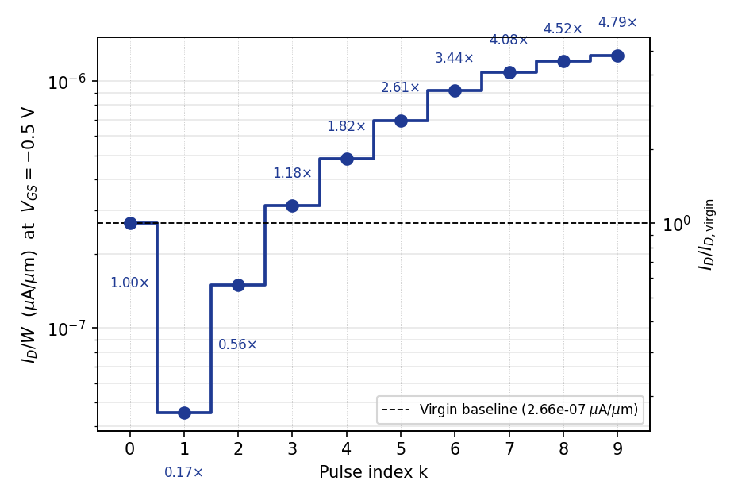
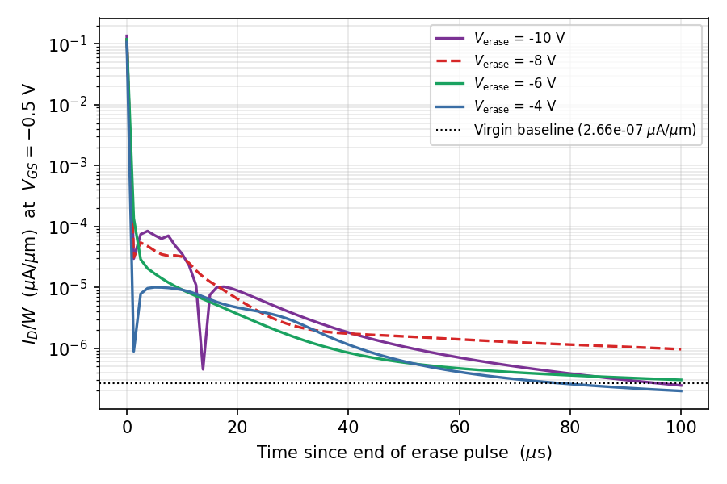
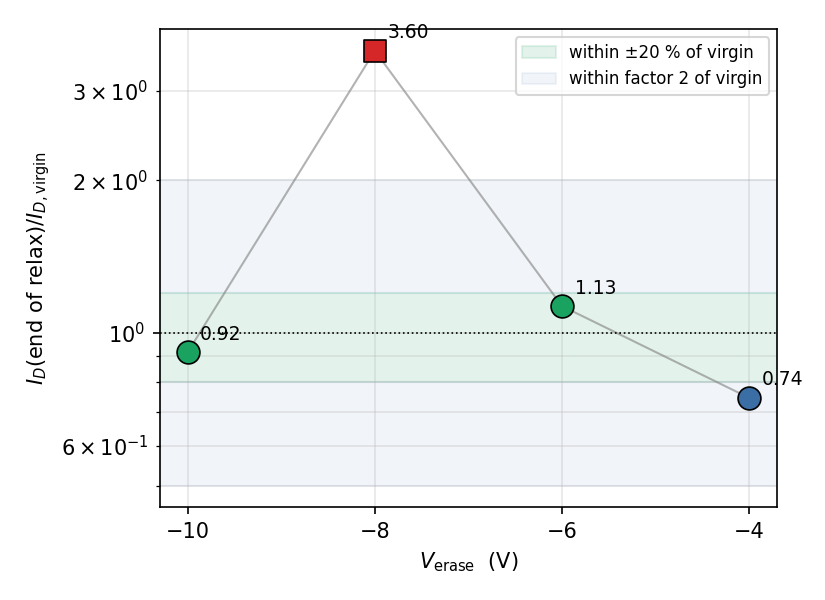

# Post-Fire Recovery Dynamics in the GAA-FeFET

Response of the device to a 9-pulse fire burst followed by a brief super-coercive negative gate pulse and a relaxation hold at the read bias. Two findings: (i) the single-shot fire response from the virgin state is a monotonic 4.79× ID staircase reading sub-threshold, and (ii) a 10 µs negative gate pulse returns the post-fire polarization to within a factor of two of the virgin state at three of four amplitudes tested, with a non-monotonic outlier at V_erase = −8 V.

---

## Summary

- **Single-shot fire from virgin:** 9 × 100 ns pulses at V_pgm = +2.0 V produce a monotonic I_D(k) staircase that clears the virgin baseline at the third pulse, the 1.5× fire threshold at the fourth pulse, and reaches **4.79× the virgin baseline at the ninth pulse**, read at V_GS = −0.5 V (sub-threshold). The FE probe at the channel-side HZO interface reports |E_y|/F_c ≈ 0.41 at the program-hold plateau — sub-coercive partial-domain switching with no FE saturation.
- **Pulsed-erase recovery:** a 10 µs hold at V_erase ∈ {−4, −6, −10} V followed by a 100 µs relax at V_GS = −0.5 V returns I_D to within a factor of two of the virgin baseline (ratios 0.74, 1.13, 0.92). V_erase = −6 V and V_erase = −10 V both fall within ±20 % of virgin.
- **V_erase = −8 V is a reproducible non-monotonic outlier** at 3.60× virgin — a trajectory-dependent intermediate Preisach state that resists back-relaxation under the read bias.
- **Effective relaxation time** at V_GS = −0.5 V is τ_relax = 13–16 µs across the sweep. A 100 µs relax hold equals 6–8 τ_relax — the FE is fully equilibrated by the end of the trace.

---

## 1. Method

### 1.1 Device

GAA-FeFET MFIS stack with HZO ferroelectric. The Preisach polarization model carries polarization-relaxation time τ_P = 10 µs and auxiliary-field relaxation τ_E = 1 µs. Drain bias V_DS = 0.05 V. Channel width W_eff = 90 nm. All currents are quoted as I_D/W in µA/µm.

### 1.2 Protocol

Per run (one run per V_erase value):

1. Quasi-stationary ramps to V_DS = 0.05 V and V_GS = −0.5 V.
2. 100 ns baseline read at V_GS = −0.5 V.
3. **Fire burst** — 9 × (1 ns rise / 100 ns hold at V_pgm = +2.0 V / 1 ns fall / 100 ns read at V_GS = −0.5 V) = 1.818 µs total.
4. 10 ns gate ramp to V_erase.
5. **Erase pulse** — 10 µs hold at V_erase, with V_erase ∈ {−4, −6, −8, −10} V.
6. 10 ns gate ramp back to V_GS = −0.5 V.
7. **Relaxation hold** — 100 µs at V_GS = −0.5 V with continuous current logging.

The gate is driven by transient-mode goal-following everywhere except the two opening quasi-static ramps, so polarization integrates against physical time on every transient phase.

### 1.3 Threshold-voltage proxy

All currents are read at fixed V_GS = −0.5 V (sub-threshold). The channel sits in the exponential subthreshold region (calibrated SS = 100 mV/dec post-program), so I_D ratios at this bias map directly onto V_t shifts: a 10× change in I_D corresponds to ≈ 100 mV in V_t. No explicit V_t extraction is performed.

---

## 2. Results

### 2.1 Single-shot integration response from the virgin state

**Figure 1.** Step plot of drain current per unit width at V_GS = −0.5 V after each of the nine 100 ns program pulses applied to the virgin device. The first pulse produces a wake-up drop to 17 % of the virgin baseline; the response is strictly monotonic from the first pulse onward, crosses the virgin baseline at the third pulse and the 1.5× fire threshold at the fourth pulse. The ninth pulse delivers a fire ratio of **4.79×** the virgin baseline.

The integration proceeds purely by partial-domain Preisach switching: |E_y|/F_c ≈ 0.41 at the program-hold plateau is well below the analytical coercive gate voltage V_c,gate = 1.91 V documented in [PE_Loop/](../PE_Loop/). No FE saturation is reached during the burst in either polarity.

Data: [`data/cycle1_staircase.csv`](data/cycle1_staircase.csv).

### 2.2 Relaxation trajectory after the erase pulse

**Figure 2.** I_D(t) per unit width at V_GS = −0.5 V over the 100 µs relaxation hold that follows the erase pulse, with time zeroed at the end of the 10 ns gate ramp from V_erase back to V_GS = −0.5 V. The dotted line is the virgin baseline 2.66 × 10⁻⁷ µA/µm. The first ~1 µs of each trace is dominated by the displacement-current transient of the ramp; the FE-coupled channel-current relaxation governs the trajectory thereafter.

The three relaxation curves at V_erase ∈ {−4, −6, −10} V converge to within a factor of two of the virgin baseline by 100 µs. Exponential fits on the 20 µs–100 µs portion of the decay give τ_relax = 13.1, 13.7, 13.6 µs at V_erase = −4, −6, −10 V respectively — all consistent with the parameter file's τ_P = 10 µs coupled with τ_E = 1 µs through MFIS depolarization screening. The 100 µs hold is ≥ 6 τ_relax: the FE is fully equilibrated at the end of the trace.

The V_erase = −8 V trajectory (red, dashed) sits an order of magnitude above the virgin baseline throughout and asymptotes at 3.60× virgin — see §2.4.

Data: [`data/relax_trajectories.csv`](data/relax_trajectories.csv), [`data/erase_trajectories.csv`](data/erase_trajectories.csv).

### 2.3 Virgin-restoration dependence on V_erase

**Figure 3.** Ratio of the end-of-relax current at V_GS = −0.5 V to the pre-burst virgin baseline, plotted against V_erase. Green band: within ±20 % of virgin. Blue band: within factor of two of virgin. Red square: off-virgin.

| V_erase (V) | End-of-relax I_D / W (µA/µm) | Restoration ratio | τ_relax (µs) | Verdict |
|---:|---:|---:|---:|:---|
| **−10** | 2.44 × 10⁻⁷ | **0.92** | 13.6 | within ±20 % of virgin |
| −8 | 9.57 × 10⁻⁷ | 3.60 | 15.8 | off-virgin |
| **−6** | 3.00 × 10⁻⁷ | **1.13** | 13.7 | within ±20 % of virgin |
| **−4** | 1.98 × 10⁻⁷ | **0.74** | 13.1 | within factor 2 of virgin |

V_erase = −6 V and V_erase = −10 V both restore the FE to within ±20 % of the virgin baseline. V_erase = −4 V lands at 0.74× — within a factor of two of virgin, on the slightly-erased side.

Data: [`data/restoration_vs_Verase.csv`](data/restoration_vs_Verase.csv).

### 2.4 The V_erase = −8 V non-monotonicity

Restoration ratio is non-monotonic in V_erase: 0.74 → 1.13 → **3.60** → 0.92 as |V_erase| increases from 4 V to 10 V. The trajectories of Figure 2 confirm this is reproducible Preisach hysteresis-trajectory dependence, not solver noise.

Mechanism: the V_erase = −10 V hold drives the FE deep into the −Pol rail (|E_y|/F_c ≈ 1.49 at the FE probe); on the return ramp to V_GS = −0.5 V the polarization distribution crosses the rising-branch coercive boundary cleanly and lands at +Pol_remanent ≈ virgin. The V_erase = −6 V hold is just super-coercive (|E_y|/F_c ≈ 1.17) and lands the FE slightly above virgin. The V_erase = −4 V hold is sub-coercive (|E_y|/F_c ≈ 0.83) and produces only a partial polarization rebalance — the FE settles slightly below virgin via depolarization-driven relaxation. The V_erase = −8 V hold lands the FE on an intermediate Preisach state whose post-relax equilibrium at V_GS = −0.5 V sits at 3.60× virgin: the residual partial −Pol screens out at the read bias and the channel current is held elevated through the relaxation hold.

---

## 3. Discussion

### 3.1 Pulsed reset crosses the coercive field; DC holds do not

Static holds at any constant gate bias in the practical range −3.5 V to +1.0 V relax the post-fire polarization further along the same +Pol branch instead of crossing back to virgin. The MFIS stack's quasi-equilibrium depolarization screening cancels ~74 % of the applied reverse gate bias at the FE probe at DC (measured directly in [Memory_Window_Programming/](../Memory_Window_Programming/) from the |E_y| asymmetry between PGM and ERS hold readings), so even a −3.5 V hold delivers only |E|/F_c ≈ 0.3–0.4 at the FE.

A 10 µs pulse breaks this symmetry. The applied gate voltage reaches the FE before the slow charge redistribution that builds full depolarization screening has time to settle (τ_E = 1 µs gates the auxiliary-field response); the FE crosses the coercive boundary during the early part of the hold and lands on the −Pol rail. On lift back to V_GS = −0.5 V the FE relaxes across the rising-branch coercive boundary with τ ≈ 14 µs and settles near virgin.

### 3.2 Operating-point selection

Two operating points are within ±20 % of virgin: V_erase = −10 V (best restoration, deeper rail traversal, higher field stress at the FE) and V_erase = −6 V (1.13× virgin, lower field stress, marginal super-coercive). V_erase = −4 V (0.74×) is a sub-coercive partial-rebalance alternative with the lowest field but a 26 % under-restoration. V_erase = −8 V should be avoided — restoration there is set by an intermediate Preisach state whose position depends on the prior fire trajectory, so this point is brittle.

### 3.3 Cycle implications

A 9-pulse fire produces a 4.79× monotonic integration trajectory; a 10 µs super-coercive negative pulse plus 100 µs relax at the read bias returns the FE to within ±20 % of virgin at two of the four amplitudes tested. The combination supports repeated fire-from-baseline cycling without polarization runaway. The 100 µs relax hold is conservative — five τ_relax (≈ 70 µs) suffices for > 99 % equilibration.

---

## 4. Files

| File | Content |
|---|---|
| `Post_Fire_Recovery_Dynamics.md` | this document |
| `data/cycle1_staircase.csv` | virgin-start 9-pulse staircase, I_D vs pulse index |
| `data/relax_trajectories.csv` | I_D(t) over the 100 µs relax at V_GS = −0.5 V, one column per V_erase |
| `data/erase_trajectories.csv` | I_D(t) during the 10 µs erase hold (at V_erase) |
| `data/restoration_vs_Verase.csv` | end-of-relax I_D, τ_relax, and restoration ratio vs V_erase |
| `figures/fig_cycle1_lif_staircase.png` | Figure 1 — virgin-state fire staircase |
| `figures/fig_relax_trajectories.png` | Figure 2 — relax I_D(t) for all four V_erase values |
| `figures/fig_restoration_vs_Verase.png` | Figure 3 — restoration ratio vs V_erase |
